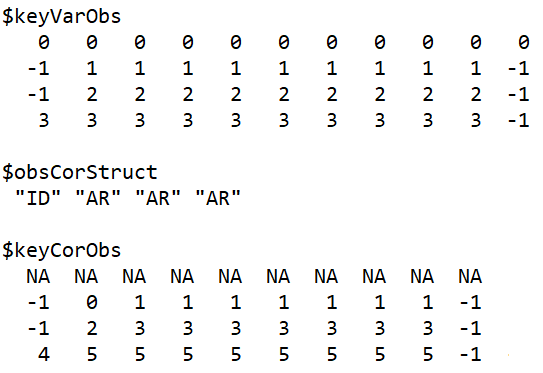

  
 In this vignette we elaborate the available options in SAM for configuring the observation variance of the indices and catches.

We want to hight that the configurations below can be combined. The user can e.g. say that we want to estimate correlation structures internally for all surveys, utilize external variance estimates for catch data, and apply a link between prediction and variance for all surveys.

## 1) Internally estimated variance and correlation


The configuration setting `keyVarObs` couples the observation variances. Covariance structures are assigned by modifying the configuration settings `obsCorStruct` and `keyCorObs`. 

<details>  
  <summary> Configuration example: </summary>


```{r,echo=FALSE, comment="", out.width = "300px"}
  
```


An example of configuration settings imposing separate variance parameters for each fleet, independence between ages in catch data (typically used), and AR1 structure between ages within each survey. Note that separate AR1-parameter are here assumed between the youngest ages within each survey. Details regarding the correlation structures are provided here: [Berg and Nielsen (2016)](https://academic.oup.com/icesjms/article/73/7/1788/2458744)
</details>

When exploring the correlation structure for a given survey, it is often convenient to apply a free correlation structure by assigning `obsCorStruct` to "US", and couple the AR1 parameters by investigating the estimated correlation structure with `corplot()`.

## 2) Prediction-variance link

SAM can accomondate for a possible link between observation variance and the corresponding predicted observation. The intuition behind the link is that the relative uncertainty typically decrease with the expected observation size. E.g. if we predict 1 fish, the observation is typically more likely to miss the prediction with a given factor compared to if we prediced a million fish. 

\vspace{2mm}
Let $\mu_{a,y}$ be the predicted observation for age $a$ at year $y$ on natural scale, and let $v_{a,y}$ be the corresponding variance. With this option we impose the assumption that
\begin{align}
v_{a,y} = \alpha \mu_{a,y}^{\beta},  \nonumber
\end{align}
and estimate $\alpha$ and $\beta$ internally in SAM.

The prediction-variance link option is selcted by providing the configuration `predVarObsLink` which couples the $\beta$ parameters. SAM will further use the settings provided in `keyVarObs` to couple the $\alpha$ parameters. See [here](https://github.com/fishfollower/SAM/blob/master/testmore/neaHaddockPredVar/script.R)  for an example.

## 3) External variance/covariance estimates
The user can provide external variance and covariance estimates for the observations. Here we go trough these options:
  
1. Provide external observation variance estimates.
1. Provide external observation correlation matrices.
1. Provide external observation covariance matrices.


#### Provide external variance estimates


External observation variance estimates can be included in SAM. This is achived by assigning a `weight` attribute to the corresponding survey or catch data before it is passed to `setup.sam.data()`. The `weight` attribute must have the same dimensions as the correspoonding observation matrix, and provide the precision of each estimate.

An example with use of external variance estimates is provided [here](https://github.com/fishfollower/SAM/blob/master/testmore/herringVar/script.R). The important lines in this example are when we assign the `weight` attributes equal the precision:
```r
attributes(cn)$weight = 1/varC
attributes(surveys[[1]])$weight = 1/varS1
attributes(surveys[[2]])$weight = 1/varS2
attributes(surveys[[3]])$weight = 1/varS3
```


The provided external variance estimates are by default used in SAM as relative weights, i.e. scaled with the internal estimated observation variance coupled with the `keyVarObs` configuration. We can use the provided variance estimates as fixed variances by setting the `fixVarToWeight` configuration equal to 1.  

Remember that there are options available for estimating the observation correlation structure in SAM by choosing the desiered `obsCorStruct` configuration. If the user provide external variances, we recomend to investigate to combine those with an internally estimated correlation structures. 


#### Provide external correlation matrices

External correlation matrices can be provided by assigning a list containing the correlation matrices as an attribute to the corresponding data. The attribute must be named `cor`. An example with use of external correlation matrices is provided [here](https://github.com/fishfollower/SAM/blob/master/testmore/nscodcovar/script.R). The important line in this example is when we assign `cor` equal the list of externally estimated correlation matrices:
```r
attr(surveys[[2]], "cor") <- lapply(1:23, function(i)estcor)
```


#### Provide external covariance matrices

External covariance matrices can be provided by assigning a list with the covariance matrices as an attribute named `cov-weight` to the given data. For an example, see [here](https://github.com/fishfollower/SAM/blob/master/testmore/nscodcovar/script.R). The important line in this example is when we assign the `cov-weight` attribute equal the list with the externally estimated  covariance matrices:
```r
attr(surveys[[2]], "cov-weight") <- lapply(1:23, function(i)estcov)
```
Note that the estimated variances will be scaled internally in SAM when we provide the `cov-weight` attribute, and the correlation structure will be used as fixed. If we want to use the externally estiamted variances as fixed, we rename the attribut to `cov`, i.e:
```r
attr(surveys[[2]], "cov") <- lapply(1:23, function(i)estcov)
```
